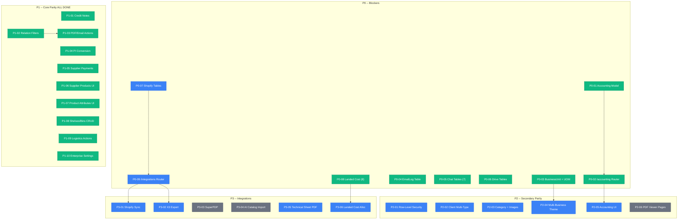

# Task Dependency Graph (Revalidated)

Generated: 2026-02-09

This document replaces prior completion claims and lists the current open work based on the latest codebase audit (`gapanalysis.md`, `Refactor/migration/migration-gap-analysis*.md`). Tasks not listed here are assumed complete, deprecated, or out of scope for parity.

## Summary

| Status       | Count |
| ------------ | ----- |
| Completed    | 17    |
| In Progress  | 0     |
| Pending      | 11    |
| Backlog      | 3     |
| **Total**    | **31**|

## Progress Overview

```
Overall   [==================----------]  55% (17/31)

P0 Blockers           [=======-----------]  78% (7/9)
P1 Core Parity        [==================]  100% (10/10)
P2 Secondary          [-----------------]  0% (0/6)
P3 Integrations       [-----------------]  0% (0/6)
```

## Completion by Priority

| Priority                    | Total | Done | In Progress | Pending | Backlog | Completion |
| --------------------------- | ----- | ---- | ----------- | ------- | ------- | ---------- |
| P0: Blockers                | 9     | 7    | 0           | 2       | 0       | **78%**    |
| P1: Core Parity             | 10    | 10   | 0           | 0       | 0       | **100%**   |
| P2: Secondary               | 6     | 0    | 0           | 5       | 1       | **0%**     |
| P3: Integrations/Automation | 6     | 0    | 0           | 4       | 2       | **0%**     |

## Dependency Graph



---

## Task List by Priority

### P0 -- Blockers (Data Model + Router Correctness)

- [x] **P0-01** Align accounting allocation data model -- Rewrote `payment_allocation_service`, `statement_service`, `accounting_service` to use `ClientInvoicePayment` (TM_CPY). *(Commit: `4aed453`)*
- [x] **P0-02** Mount `/accounting` router -- 6 endpoints: receivables aging, payment allocation, payment detail, invoice payments list, client unpaid invoices, client statement. *(Commit: `4aed453`)*
- [x] **P0-03** Create BusinessUnit + UnitOfMeasure tables -- Migration V1.0.0.4, models restored, lookup service updated with live queries. *(Commit: `4aed453`)*
- [x] **P0-04** Create `TM_SET_EmailLog` -- Migration V1.0.0.5, model restored, EmailService queries fixed to use actual column names. *(Commit: `4aed453`)*
- [x] **P0-05** Create `TM_CHT_*` chat tables -- Migration V1.0.0.6 (7 tables), all models restored, service/repository/endpoint fixed. *(Commit: `4aed453`)*
- [x] **P0-06** Create `TM_DRV_*` drive tables -- Migration V1.0.0.7, DriveFile + DriveFolder models, drive service rewritten with async wrappers. *(Commit: `4aed453`)*
- [ ] **P0-07** Create Shopify integration tables (`TR_SHP_*`, `TM_SHP_*`, `TM_INT_ShopifyStore`) and re-enable models.
- [x] **P0-08** Create landed cost tables -- Migration V1.0.0.8 (8 tables), all models restored, router enabled (17 endpoints), `supply_lot.py` deprecated. *(Commit: `4aed453`)*
- [ ] **P0-09** Mount `/integrations` router after P0-07 and verify Shopify/X3 endpoints do not error. *(Blocked by: P0-07)*

### P1 -- Core Legacy Parity (User Workflows)

- [x] **P1-01** Credit note workflow -- `POST /invoices/{id}/credit-note` with line cloning, amount negation, `cin_avoir_id` linkage. *(Commit: `4aed453`)*
- [x] **P1-02** Relation filter endpoints -- Added `project_id` to quotes, `project_id`+`quote_id` to orders, `project_id`+`order_id` to invoices. *(Commit: `4aed453`)*
- [x] **P1-03** PDF/Email actions -- Fixed PDF service table refs, added send/pdf endpoints to invoices/quotes/orders/deliveries, wired frontend buttons. *(Commit: `4aed453`)*
- [x] **P1-04** Purchase Intent conversion -- `POST /purchase-intents/{id}/convert-to-supplier-order` with line copying and PI closure. *(Commit: `4aed453`)*
- [x] **P1-05** Supplier order payment records -- CRUD service + 4 endpoints with auto-recalculation of order `sod_paid`/`sod_need2pay`. *(Commit: `4aed453`)*
- [x] **P1-06** Supplier Product list UI -- Products tab added to supplier detail page with DataTable, search, pagination. *(Commit: `4aed453`)*
- [x] **P1-07** Product Attribute management UI -- Full CRUD page at `/products/attributes/` with modal forms, route tree updated. *(Commit: `4aed453`)*
- [x] **P1-08** Warehouse shelves/bins -- ShelfService + 6 endpoints (list/create/get/update/delete shelves, list products on shelf). *(Commit: `4aed453`)*
- [x] **P1-09** Logistics send/receive/stock-in -- 3 POST endpoints with strict status flow: Pending -> Sent -> Received -> Stocked In. *(Commit: `4aed453`)*
- [x] **P1-10** Enterprise Settings -- Full stack: SocietyService, settings router (4 endpoints), frontend page with 4 card sections, i18n (fr/en/zh). *(Commit: `4aed453`)*

### P2 -- Secondary Parity (Quality + Completeness)

- [ ] **P2-01** Implement row-level security (commercial hierarchy filtering).
- [ ] **P2-02** Implement client multi-type assignment + contact address type flags.
- [ ] **P2-03** Add category CRUD + product image management.
- [ ] **P2-04** Implement multi-business theming and business-unit linking. *(Depends on: P0-03)*
- [ ] **P2-05** Enable accounting statements/aging UI. *(Depends on: P0-01, P0-02)*
- [ ] **P2-06** Add PDF viewer/download pages (PageDownLoad/PageForPDF equivalent). *(Backlog)*

### P3 -- Integrations & Automation

- [ ] **P3-01** Shopify sync workflows (orders/products/customers/inventory) + auto order->invoice; remove TODOs. *(Blocked by: P0-07, P0-09)*
- [ ] **P3-02** X3 export payments + bulk mapping import. *(Blocked by: P0-09)*
- [ ] **P3-03** SuperPDP e-invoicing integration. *(Backlog)*
- [ ] **P3-04** AI catalog import + translation pipeline. *(Backlog)*
- [ ] **P3-05** Technical sheet PDF generation (product images/specs).
- [ ] **P3-06** Landed cost allocation workflow. *(Depends on: P0-08)*

---

## Validated Complete (Context)

- Core CRUD flows for quotes, orders, deliveries, invoices
- Supplier orders/invoices + purchase intents (CRUD)
- Warehouse stock, movements, and adjustments
- Payment recording (TM_CPY/TR_SPR)
- Document attachments (TM_DOC_DocumentAttachment)
- List endpoint fixes (camelCase + totals)
- Query performance optimization across all list endpoints

---

## Migrations Applied

| Version  | Description                               | Date       |
| -------- | ----------------------------------------- | ---------- |
| V1.0.0.0 | Init migration history                   | baseline   |
| V1.0.0.1 | Create document attachments              | baseline   |
| V1.0.0.2 | Create client product price              | baseline   |
| V1.0.0.3 | Create supplier product price            | baseline   |
| V1.0.0.4 | Create BusinessUnit + UnitOfMeasure      | 2026-02-09 |
| V1.0.0.5 | Create EmailLog table                    | 2026-02-09 |
| V1.0.0.6 | Create Chat tables (7 tables)            | 2026-02-09 |
| V1.0.0.7 | Create Drive tables                      | 2026-02-09 |
| V1.0.0.8 | Create Landed Cost tables (8 tables)     | 2026-02-09 |

---

## Implementation Stats (Session 2026-02-09)

| Metric                  | Value    |
| ----------------------- | -------- |
| Tasks completed         | 17       |
| Files changed           | 81       |
| Lines added             | +11,567  |
| Lines removed           | -5,902   |
| New files created       | 14       |
| DB migrations added     | 5        |
| New API endpoints       | ~40      |
| Frontend pages added    | 2        |
| i18n keys added         | ~45      |
| Commit                  | `4aed453`|

---

## Last Updated

- **Date**: 2026-02-09
- **Basis**: Implementation session -- 17 tasks completed (7 P0 + 10 P1), pushed as commit `4aed453`
