# Task Dependency Graph (Full Parity Audit)

Generated: 2026-02-09 (Round 3 - Field-Level Verification)

This document is based on a comprehensive side-by-side comparison of:
- **Legacy .NET ERP** (44+ ASPX screens, 70+ JS modules, 100+ ASMX service methods)
- **Current React/FastAPI ERP2025** (55+ routes, 40+ API files, 50+ hooks, 80+ services)
- **Live legacy UI exploration** via browser automation
- **Field-level model/schema/form verification** (4 parallel agents verifying products, clients, documents, ASMX methods)

## Summary

| Status       | Count |
| ------------ | ----- |
| Completed    | 47    |
| In Progress  | 0     |
| Pending      | 4     |
| Backlog      | 2     |
| **Total**    | **53**|

## Progress Overview

```
Overall   [===========================---]  89% (47/53)

P0 Blockers           [=======-----------]  78% (7/9)
P1 Core Parity        [==================]  100% (10/10)
P2 Secondary Parity   [==================]  100% (18/18)
P3 Integrations       [=========---------]  50% (4/8)
P4 Polish & Beyond    [==================]  100% (8/8)
```

## Completion by Priority

| Priority                    | Total | Done | In Progress | Pending | Backlog | Completion |
| --------------------------- | ----- | ---- | ----------- | ------- | ------- | ---------- |
| P0: Blockers                | 9     | 7    | 0           | 2       | 0       | **78%**    |
| P1: Core Parity             | 10    | 10   | 0           | 0       | 0       | **100%**   |
| P2: Secondary Parity        | 18    | 18   | 0           | 0       | 0       | **100%**   |
| P3: Integrations/Automation | 8     | 4    | 0           | 2       | 2       | **50%**    |
| P4: Polish & Beyond         | 8     | 8    | 0           | 0       | 0       | **100%**   |

## Dependency Graph

```mermaid
flowchart TD
  subgraph "P0 -- Blockers"
    p0_01["P0-01 Accounting Model"]:::done
    p0_02["P0-02 /accounting Router"]:::done
    p0_03["P0-03 BusinessUnit + UOM"]:::done
    p0_04["P0-04 EmailLog Table"]:::done
    p0_05["P0-05 Chat Tables (7)"]:::done
    p0_06["P0-06 Drive Tables"]:::done
    p0_07["P0-07 Shopify Tables"]:::pending
    p0_08["P0-08 Landed Cost (8)"]:::done
    p0_09["P0-09 /integrations Router"]:::pending
  end

  subgraph "P1 -- Core Parity  ALL DONE"
    p1_01["P1-01 Credit Notes"]:::done
    p1_02["P1-02 Relation Filters"]:::done
    p1_03["P1-03 PDF/Email Actions"]:::done
    p1_04["P1-04 PI Conversion"]:::done
    p1_05["P1-05 Supplier Payments"]:::done
    p1_06["P1-06 Supplier Products UI"]:::done
    p1_07["P1-07 Product Attributes UI"]:::done
    p1_08["P1-08 Shelves/Bins CRUD"]:::done
    p1_09["P1-09 Logistics Actions"]:::done
    p1_10["P1-10 Enterprise Settings"]:::done
  end

  subgraph "P2 -- Secondary Parity"
    p2_01["P2-01 Row-Level Security"]:::done
    p2_02["P2-02 Client Multi-Type"]:::done
    p2_03["P2-03 Category + Images"]:::done
    p2_04["P2-04 Multi-Business Theme"]:::done
    p2_05["P2-05 Accounting UI"]:::done
    p2_06["P2-06 PDF Viewer Pages"]:::done
    p2_07["P2-07 Dashboard Widgets"]:::done
    p2_08["P2-08 Reverse Doc Clone"]:::done
    p2_09["P2-09 Discount Modals"]:::done
    p2_10["P2-10 Invoice Statement UI"]:::done
    p2_11["P2-11 Client Pricing UI"]:::done
    p2_12["P2-12 Bank/RIB Management"]:::done
    p2_13["P2-13 Doc Address Snapshot"]:::done
    p2_14["P2-14 Delegator System UI"]:::done
    p2_15["P2-15 Client Form Fields"]:::done
    p2_16["P2-16 Product Components"]:::done
    p2_17["P2-17 Doc Line Images"]:::done
    p2_18["P2-18 Delivery→Invoice Bulk"]:::done
  end

  subgraph "P3 -- Integrations"
    p3_01["P3-01 Shopify Sync"]:::pending
    p3_02["P3-02 X3 Export"]:::pending
    p3_03["P3-03 SuperPDP"]:::backlog
    p3_04["P3-04 AI Catalog Import"]:::backlog
    p3_05["P3-05 Technical Sheet PDF"]:::done
    p3_06["P3-06 Landed Cost Alloc"]:::done
    p3_07["P3-07 Data Import Wizard"]:::done
    p3_08["P3-08 Product Express Bulk"]:::done
  end

  subgraph "P4 -- Polish & Beyond"
    p4_01["P4-01 Currency Exchange Mgmt"]:::done
    p4_02["P4-02 Document Templates"]:::done
    p4_03["P4-03 Bulk Status Change"]:::done
    p4_04["P4-04 Line Merge/Reorder"]:::done
    p4_05["P4-05 Inspection Forms"]:::done
    p4_06["P4-06 Backorder Tracking"]:::done
    p4_07["P4-07 Lookup Endpoints Gap"]:::done
    p4_08["P4-08 Pricing Coefficient"]:::done
  end

  %% Dependency arrows
  p0_01 --> p0_02
  p0_02 --> p2_05
  p0_03 --> p2_04
  p0_07 --> p0_09
  p0_09 --> p3_01
  p0_09 --> p3_02
  p0_08 --> p3_06
  p1_10 --> p2_12
  p1_10 --> p4_01
  p1_10 --> p4_02
  p1_10 --> p4_08
  p2_02 --> p2_13
  p2_02 --> p2_14
  p2_05 --> p2_10
  p1_01 --> p2_09
  p2_15 --> p2_13
  p2_16 --> p3_05

  classDef done fill:#10b981,stroke:#059669,color:#fff
  classDef inprogress fill:#f59e0b,stroke:#d97706,color:#fff
  classDef pending fill:#3b82f6,stroke:#2563eb,color:#fff
  classDef backlog fill:#6b7280,stroke:#4b5563,color:#fff
```



---

## Task List by Priority

### P0 -- Blockers (Data Model + Router Correctness)

- [x] **P0-01** Align accounting allocation data model -- Rewrote `payment_allocation_service`, `statement_service`, `accounting_service` to use `ClientInvoicePayment` (TM_CPY). *(Commit: `4aed453`)*
- [x] **P0-02** Mount `/accounting` router -- 6 endpoints: receivables aging, payment allocation, payment detail, invoice payments list, client unpaid invoices, client statement. *(Commit: `4aed453`)*
- [x] **P0-03** Create BusinessUnit + UnitOfMeasure tables -- Migration V1.0.0.4, models restored, lookup service updated with live queries. *(Commit: `4aed453`)*
- [x] **P0-04** Create `TM_SET_EmailLog` -- Migration V1.0.0.5, model restored, EmailService queries fixed to use actual column names. *(Commit: `4aed453`)*
- [x] **P0-05** Create `TM_CHT_*` chat tables -- Migration V1.0.0.6 (7 tables), all models restored, service/repository/endpoint fixed. *(Commit: `4aed453`)*
- [x] **P0-06** Create `TM_DRV_*` drive tables -- Migration V1.0.0.7, DriveFile + DriveFolder models, drive service rewritten with async wrappers. *(Commit: `4aed453`)*
- [ ] **P0-07** Create Shopify integration tables (`TR_SHP_*`, `TM_SHP_*`, `TM_INT_ShopifyStore`) and re-enable models.
- [x] **P0-08** Create landed cost tables -- Migration V1.0.0.8 (8 tables), all models restored, router enabled (17 endpoints), `supply_lot.py` deprecated. *(Commit: `4aed453`)*
- [ ] **P0-09** Mount `/integrations` router after P0-07 and verify Shopify/X3 endpoints do not error. *(Blocked by: P0-07)*

### P1 -- Core Legacy Parity (User Workflows) -- ALL DONE

- [x] **P1-01** Credit note workflow -- `POST /invoices/{id}/credit-note` with line cloning, amount negation, `cin_avoir_id` linkage. *(Commit: `4aed453`)*
- [x] **P1-02** Relation filter endpoints -- Added `project_id` to quotes, `project_id`+`quote_id` to orders, `project_id`+`order_id` to invoices. *(Commit: `4aed453`)*
- [x] **P1-03** PDF/Email actions -- Fixed PDF service table refs, added send/pdf endpoints to invoices/quotes/orders/deliveries, wired frontend buttons. *(Commit: `4aed453`)*
- [x] **P1-04** Purchase Intent conversion -- `POST /purchase-intents/{id}/convert-to-supplier-order` with line copying and PI closure. *(Commit: `4aed453`)*
- [x] **P1-05** Supplier order payment records -- CRUD service + 4 endpoints with auto-recalculation of order `sod_paid`/`sod_need2pay`. *(Commit: `4aed453`)*
- [x] **P1-06** Supplier Product list UI -- Products tab added to supplier detail page with DataTable, search, pagination. *(Commit: `4aed453`)*
- [x] **P1-07** Product Attribute management UI -- Full CRUD page at `/products/attributes/` with modal forms, route tree updated. *(Commit: `4aed453`)*
- [x] **P1-08** Warehouse shelves/bins -- ShelfService + 6 endpoints (list/create/get/update/delete shelves, list products on shelf). *(Commit: `4aed453`)*
- [x] **P1-09** Logistics send/receive/stock-in -- 3 POST endpoints with strict status flow: Pending -> Sent -> Received -> Stocked In. *(Commit: `4aed453`)*
- [x] **P1-10** Enterprise Settings -- Full stack: SocietyService, settings router (4 endpoints), frontend page with 4 card sections, i18n (fr/en/zh). *(Commit: `4aed453`)*

### P2 -- Secondary Parity (Quality + Completeness)

- [x] **P2-01** Implement row-level security (commercial hierarchy filtering).
  - Legacy: Different buttons/sections shown based on role. `modify_right` CSS class controls edit permissions. Commercial 1-3 hierarchy on all documents.
  - Implemented: Row-level commercial filtering is now applied on quote/order/invoice list queries for non-admin users.

- [x] **P2-02** Implement client multi-type assignment + contact address type flags.
  - Legacy: Client contacts have `Invoice checkbox` + `Delivery checkbox` flags per contact. Contact grid columns: Title, Reference, Name, Phone/Fax, Mobile, Invoice, Delivery, Address, Postal Code, City, Email, Login.
  - Implemented: Contact invoice/delivery flags are available in API/schema and surfaced in client contact UI badges.

- [x] **P2-03** Add category CRUD + product image management.
  - Legacy: `Category.aspx` with hierarchical parent-child categories, sub-names, ordering, active flag, display-in-menu/exhibition flags, image upload. `SearchCategory.aspx` for search.
  - Implemented: Category CRUD API + UI (including hierarchy fields) and product image/document attachments are available.

- [x] **P2-04** Implement multi-business theming and business-unit linking. *(Depends on: P0-03)*
  - Legacy: Single society with config. New ERP plans LED/DOMOTICS/HVAC/WAVECONCEPT/ACCESSORIES color themes.
  - Implemented: Business-unit aware accent themes are available with runtime BU theme linking in the app layout/theme store.

- [x] **P2-05** Enable accounting statements/aging UI. *(Depends on: P0-01, P0-02)*
  - Legacy: `ClientInvoiceStatment.aspx` with client search, commercial filter, date range, generate PDF with/without invoice, generate BL PDF, download CSV. Result grid: Company, Invoice#, Invoice Date, Due Date, Amount HT, Amount TTC, Amount Paid, Amount To Pay, Commercial.
  - Implemented: Statement + aging UI is active with filters, KPI summary cards, transaction grid, and exports.

- [x] **P2-06** Add PDF viewer/download pages (PageDownLoad/PageForPDF equivalent).
  - Legacy: `PageDownLoad.aspx` + `PageForPDF.aspx` for file downloads and PDF preview.
  - Implemented: Utility PDF mode in `/_authenticated/accounting/export` with whitelist source validation, blob fetch, iframe preview/download, and detail-page wiring for quote/order/invoice/delivery (+ product technical sheet and invoice inspection form sources).

- [x] **P2-07** Dashboard widgets -- full parity with legacy 8-widget dashboard.
  - Legacy widgets (from live UI exploration):
    1. Devis en cours (Quotes in progress) -- current + previous month with "Modifier le statut" action
    2. Fonction Reliquat (Backorder function)
    3. Bon de livraison a livrer (Delivery notes to deliver)
    4. Bon de livraison a facturer (Delivery notes to invoice)
    5. Facture client non payee (Unpaid client invoices)
    6. PI non payee (Unpaid proforma invoices)
    7. Container non expedie (Unshipped containers)
    8. Container arrivant (Arriving containers)
  - Implemented: Dashboard KPI backend endpoint and frontend widget cards/sections cover legacy dashboard counters.

- [x] **P2-08** Reverse document clone (Order→Quote).
  - Legacy JS: `DuplicateClientOrder2CostPlan(codId, sameProject)` -- creates a new quote from an existing order (reverse conversion).
  - **Verified**: Quote duplication (`POST /quotes/{id}/duplicate`), order duplication, and supplier order duplication already exist in backend + frontend hooks. Quote→Order conversion also works.
  - Implemented: `POST /orders/{id}/convert-to-quote` endpoint plus frontend action/button flow.

- [x] **P2-09** Discount management modals per document type.
  - Legacy: Separate discount modal with `AddUpdateClientOrderDiscount(codId, discountPercentage, discountAmount)`. Both percentage and fixed-amount discounts. Applied at document level (header discount), separate from line-level discounts.
  - Implemented: Discount modals/actions are wired on quote/order/invoice detail pages with corresponding backend endpoints.

- [x] **P2-10** Invoice statement UI page (full feature parity).
  - Legacy: `ClientInvoiceStatment.aspx` -- client autocomplete (required), commercial dropdown, date range (from/to), search results grid with footer summary totals, 4 export actions (PDF with invoice, PDF without invoice, BL PDF, CSV download).
  - Implemented: Statement page supports PDF (with/without invoice), BL PDF, and CSV exports. *(Depends on: P2-05)*

- [x] **P2-11** Client product pricing UI.
  - Legacy: `ClientPrice.aspx` -- two-column layout: left=product list with count, right=price details for selected product. Allows per-client price overrides.
  - Implemented: Client detail now supports client-specific pricing create/delete actions from the pricing panel.

- [x] **P2-12** Enterprise Settings -- bank/RIB management section.
  - Legacy: `EnterpriseSetting.aspx` has multiple RIB (bank info) sections: bank name, agency, account #, RIB key, IBAN, BIC/SWIFT. Multiple banks supported with create/delete. Bank selection dropdown on invoices.
  - Implemented: Enterprise settings now include primary and secondary RIB/bank sections. *(Depends on: P1-10)*

- [x] **P2-13** Document address/contact snapshot (commercial vs delivery).
  - Legacy: Every document (Quote, Order, Invoice, Delivery) has two address blocks: "Adresse commerciale client" (billing) and "Adresse de livraison" (shipping). Each has: title, ref, firstname, lastname, address1, address2, postcode, city/country, phone, fax, mobile, email.
  - Implemented: Quote/order/invoice APIs and detail UIs now expose/display invoicing + delivery snapshots. *(Depends on: P2-02, P2-15)*

- [x] **P2-14** Delegator/Delegatee system UI.
  - Legacy: `Client.aspx` has a dedicated section (right column, 3 cols wide) for managing delegators and delegatees. Used for client billing delegation chains.
  - Implemented: Delegation management panel on client detail now supports create/list/delete delegate records. *(Depends on: P2-02)*

- [x] **P2-15** Client form field completion (19 missing fields).
  - **Verified by field-level agent**: The Client model (TM_CLI_Client) has ~50 columns, `ClientDetailResponse` schema maps most of them, but `ClientBase`/`ClientCreateDto` and `ClientForm.tsx` are missing 19 fields that exist in the legacy form:
  - **Critical missing** (in model but not in create/edit form):
    1. `cli_abbreviation` -- Company abbreviation
    2. `cli_usr_com1/2/3` -- 3 commercial/sales rep user selects
    3. `cli_invoice_day` -- Billing day of month (1-31 dropdown)
    4. `cli_invoice_day_is_last_day` -- Last day of month flag
    5. `cli_comment_for_client` -- Client-visible comment
    6. `cli_comment_for_interne` -- Internal comment
  - **Additional missing** (in model/DetailResponse but not in create form):
    7. `cli_siren` -- SIREN company registration
    8. `cli_vat_intra` -- EU intra-community VAT number
    9. `cli_tel2` -- Phone 2
    10. `cli_fax` -- Fax number
    11. `cli_accounting_email` -- Accounting email
    12. `cli_recieve_newsletter` -- Newsletter subscription checkbox
    13. `cli_newsletter_email` -- Newsletter email
    14. `act_id` -- Activity/business sector dropdown
    15. `vat_id` -- VAT rate dropdown
    16. `pco_id` -- Payment condition dropdown
    17. `cli_isactive` -- Active flag (not in create/update DTOs)
    18. `cli_isblocked` -- Blocked flag
    19. `cli_showdetail` -- Show detail flag
  - **Fix**: Add all 19 fields to `ClientBase` schema, `ClientCreateDto`, `ClientUpdateDto`, and `ClientForm.tsx` UI.

- [x] **P2-16** Product component relationships (drivers/accessories/options).
  - **Verified by field-level agent**: Legacy product form has 3 dedicated component relationship sections:
    1. **Drivers** (LED drivers/power supplies) -- with "Ajouter" button
    2. **Accessories** (mounting hardware/connectors) -- with "Ajouter" button
    3. **Options** (color temperature/wattage variants) -- with "Ajouter" button
  - Implemented: Junction model/schema/router and product-detail UI for drivers/accessories/options are in place.
  - Also missing: `prd_interior_length`, `prd_interior_width`, `prd_opening_diameter`, `prd_thickness` columns from product model.
  - Need: Junction table `TI_PRC_ProductComponent` (or similar), component type enum (driver/accessory/option), CRUD endpoints, UI tabs on product detail page.

- [x] **P2-17** Document line item image reference.
  - **Verified by field-level agent**: Legacy line items table has an "Image" column showing product image thumbnails inline.
  - Implemented: Line item image URLs are present and rendered as thumbnails in quote/order/invoice detail tables.

- [x] **P2-18** Delivery-to-invoice bulk creation.
  - **Verified by ASMX agent**: Legacy has `CreateClientInvoiceAndDeliveryDfoWithDfls(dfoId, dfls)` for creating invoices from specific delivery lines, and `CreateClientInvoiceAndDeliveryAllDfos(dfoId, mode)` for bulk invoice creation from all deliveries.
  - Implemented: `POST /invoices/from-delivery/{delivery_id}` and `POST /invoices/from-deliveries` backend endpoints + frontend single/bulk actions are available.

### P3 -- Integrations & Automation

- [ ] **P3-01** Shopify sync workflows (orders/products/customers/inventory) + auto order->invoice; remove TODOs. *(Blocked by: P0-07, P0-09)*
- [ ] **P3-02** X3 export payments + bulk mapping import. *(Blocked by: P0-09)*
  - Current: `X3ExportService` exists. Frontend has X3 mappings page. Needs router mounting + testing.
- [ ] **P3-03** SuperPDP e-invoicing integration. *(Backlog)*
- [ ] **P3-04** AI catalog import + translation pipeline. *(Backlog)*
- [x] **P3-05** Technical sheet PDF generation (product images/specs).
  - Legacy: "Export Fiche Tech" button on product search page. Generates product spec PDF with dimensions, images, accessories.
  - Implemented: `GET /products/{product_id}/technical-sheet-pdf` endpoint + product detail UI action routed through PDF utility viewer/download.
- [x] **P3-06** Landed cost allocation workflow. *(Depends on: P0-08)*
  - Implemented end-to-end parity fixes: backend allocation persistence now writes `sli_allocated_*`, `sli_total_allocated_cost`, `sli_landed_cost_per_unit`, `sli_total_landed_cost`, and lot-level totals; frontend landed-cost API mapping normalized to active backend contract; supply-lot list/detail now provide working create/edit + item/cost CRUD flows with calculate/breakdown refresh.
- [x] **P3-07** Data import wizard UI for bulk operations.
  - Legacy: `ImportData.aspx` with bulk import sections for suppliers+products, clients, project-specific deliveries. Multiline text input areas with "Traiter" (Treat/Import) buttons.
  - Implemented validation-first wizard completion: added explicit preview/validation step between column mapping and execute import, with row sample rendering, validation error grid, and controlled progression to final import execution.
- [x] **P3-08** Product express/bulk creation.
  - Legacy: `ProductExpress.aspx` / `ProductExpressJS.js` -- rapid product entry form for creating multiple products quickly with minimal fields.
  - Implemented: `POST /products/bulk-express` backend endpoint + `/products/new` dual-mode UI (Single + Express Bulk multiline parsing).

### P4 -- Polish & Beyond (New from Legacy Comparison)

- [x] **P4-01** Currency exchange rate management in settings.
  - Legacy: Enterprise Settings includes currency exchange rates: EUR/USD, CNY/USD, GBP/USD, HKD/USD, RUB/USD, MAD/USD. Used for automatic conversion on documents.
  - Implemented: Enterprise settings now includes exchange-rate create/list/delete UI backed by `/currencies/exchange-rates`. *(Depends on: P1-10)*

- [x] **P4-02** Document header/footer templates configuration.
  - Legacy: Enterprise Settings has configurable text fields for: quote header/footer, delivery conditions, invoice penalties text, early payment discount text, invoice email body content.
  - Implemented: Enterprise settings model/schema/API/UI now include all template text fields. *(Depends on: P1-10)*

- [x] **P4-03** Bulk status change on documents.
  - Legacy: `ChangeCostPlanStatus(List<string> cplIds, int cstId)` -- select multiple quotes and change status in bulk from the list view. Dashboard "Modifier le statut" button.
  - Implemented: Bulk quote status endpoint + quotes list UI batch action; orders list bulk status flow wired with existing order status endpoint.

- [x] **P4-04** Line merge/reorder on documents.
  - Legacy: Invoice/Order forms have "Merge selected lines" button. Order lines have draggable order field.
  - Implemented: Merge + reorder endpoints for quote/order/invoice lines and UI actions on all three detail pages (select/merge + up/down reorder).

- [x] **P4-05** Inspection forms linked to invoices.
  - Legacy: "Download Inspection Forms" button on invoice view (conditional -- only shown when inspection data exists).
  - Implemented: `GET /invoices/{invoice_id}/inspection-form-pdf` endpoint + conditional invoice detail UI action routed via PDF utility page.

- [x] **P4-06** Backorder/Reliquat tracking widget.
  - Implemented line-level reliquat flow: backend endpoint `GET /accounting/dashboard/backorders` computes ordered vs delivered vs remaining quantities, order detail now returns real `deliveredQuantity` per line, and dashboard now includes a dedicated "Reliquat Backorders" widget with direct links to impacted orders.

- [x] **P4-07** Lookup endpoints gap fill.
  - **Verified by ASMX agent**: Core lookups (currencies, VAT, payment terms/modes, societies, languages, countries, warehouses, carriers) all exist.
  - Implemented: Added `sub-commercials`, `line-types`, `product-instances/by-ref`, and `communes/by-postcode` endpoints + frontend API/hooks integration.

- [x] **P4-08** Pricing coefficient configuration (CoefSodCin). *(Depends on: P1-10)*
  - Legacy: `CoefSodCin = 1.2` hardcoded coefficient for Supplier Order → Client Invoice markup calculation.
  - Implemented: Added society coefficient field/migration + enterprise settings UI + invoice generation logic usage when sale price is derived from purchase price.

---

## Feature Parity Matrix (Legacy vs Current)

### Screens Fully Implemented (27/44 legacy screens)
| Legacy Screen | Current Route | Status |
|---|---|---|
| Dashboard | `/_authenticated/` | Partial (widgets incomplete) |
| Search Client | `/_authenticated/clients/` | Done |
| Create Client | `/_authenticated/clients/new` | Done |
| Search Supplier | `/_authenticated/suppliers/` | Done |
| Create Supplier | `/_authenticated/suppliers/new` | Done |
| Search Product | `/_authenticated/products/` | Done |
| Create Product | `/_authenticated/products/new` | Done |
| Product Attributes | `/_authenticated/products/attributes/` | Done |
| Search Project | `/_authenticated/projects/` | Done |
| Create Project | `/_authenticated/projects/new` | Done |
| Search Quote | `/_authenticated/quotes/` | Done |
| Create Quote | `/_authenticated/quotes/new` | Done |
| Search Order | `/_authenticated/orders/` | Done |
| Create Order | `/_authenticated/orders/new` | Done |
| Search Delivery | `/_authenticated/deliveries/` | Done |
| Create Delivery | `/_authenticated/deliveries/new` | Done |
| Search Invoice | `/_authenticated/invoices/` | Done |
| Create Invoice | `/_authenticated/invoices/new` | Done |
| Credit Note (AVOIR) | `/_authenticated/invoices/new?type=credit` | Done |
| Search Purchase Intent | `/_authenticated/purchase-intents/` | Done |
| Search Supplier Order | `/_authenticated/supplier-orders/` | Done |
| Search Supplier Invoice | `/_authenticated/supplier-invoices/` | Done |
| Warehouse | `/_authenticated/warehouse/` | Done |
| Shelves | `/_authenticated/warehouse/shelves/` | Done |
| Inventory | `/_authenticated/warehouse/inventory/` | Done |
| Search Logistics | `/_authenticated/logistics/` | Done |
| Enterprise Settings | `/_authenticated/settings/enterprise/` | Done |

### Screens Partially Implemented (7/44)
| Legacy Screen | Current Route | Gap |
|---|---|---|
| Supplier Order Status | `/_authenticated/supplier-orders/$id` | Tab exists, actions incomplete |
| Supplier Order Payment | `/_authenticated/supplier-orders/$id` | Tab exists, cross-alloc missing |
| Vouchers | `/_authenticated/warehouse/movements/` | Different model, needs mapping |
| Search Consignee | `/_authenticated/consignees/` | Route exists, testing needed |
| Album Photo | `/_authenticated/drive/` | Drive replaces album, different UX |
| Users | `/_authenticated/users/` | CRUD exists, permissions incomplete |
| Client Application | N/A | Website requests -- may not be needed |

### Screens Not Implemented (5/44)
| Legacy Screen | Priority | Notes |
|---|---|---|
| SupplierPrice.aspx | P2-11 | Supplier pricing (similar to client) |
| PinSodDetails.aspx | P2-08 | PI ↔ Supplier Order detail linking |
| SodCinPayment.aspx | P2-09 | Cross-allocation SO ↔ Invoice payment |
| SuperPDP e-Invoicing | P3-03 | Third-party integration backlog |
| AI Catalog Import Pipeline | P3-04 | Backlog (automation/translation pipeline) |

### Current-Only Features (Not in Legacy)
| Feature | Route | Notes |
|---|---|---|
| Chat (WhatsApp-like) | `/_authenticated/chat/` | Full WebSocket real-time chat |
| Drive (File Manager) | `/_authenticated/drive/` | Folder-based file management |
| Calendar & Tasks | `/_authenticated/calendar/` | Event/task scheduling |
| Brands | `/_authenticated/brands/` | Brand entity management |
| Supply Lots + Landed Cost | `/_authenticated/supply-lots/` | Advanced cost allocation |
| Shopify Integration | `/_authenticated/integrations/shopify/` | E-commerce sync |
| Sage X3 Mappings | `/_authenticated/integrations/x3/` | ERP export mappings |
| Aging Reports | `/_authenticated/accounting/aging/` | Receivables aging analysis |
| Data Import Wizard | `/_authenticated/settings/import/` | CSV import with mapping + validation preview |
| Delegates Management | `/_authenticated/clients/$id` (tab) | Billing delegates |

---

## Validated Complete (Context)

- Core CRUD flows for quotes, orders, deliveries, invoices
- Supplier orders/invoices + purchase intents (CRUD)
- Warehouse stock, movements, and adjustments
- Payment recording (TM_CPY/TR_SPR)
- Document attachments (TM_DOC_DocumentAttachment)
- List endpoint fixes (camelCase + totals)
- Query performance optimization across all list endpoints
- Chat system (WebSocket + threads + DMs + groups + search)
- Drive system (folders + files + upload + preview)
- Enterprise Settings (society info + address + legal + banking + templates + exchange rates + pricing coefficient)
- Quote/Order/Invoice detail line operations (merge + reorder)
- Invoice inspection-form PDF flow
- Warehouse 3D visualization mode (`/_authenticated/warehouse?view=3d`)

---

## Migrations Applied

| Version  | Description                               | Date       |
| -------- | ----------------------------------------- | ---------- |
| V1.0.0.0 | Init migration history                   | baseline   |
| V1.0.0.1 | Create document attachments              | baseline   |
| V1.0.0.2 | Create client product price              | baseline   |
| V1.0.0.3 | Create supplier product price            | baseline   |
| V1.0.0.4 | Create BusinessUnit + UnitOfMeasure      | 2026-02-09 |
| V1.0.0.5 | Create EmailLog table                    | 2026-02-09 |
| V1.0.0.6 | Create Chat tables (7 tables)            | 2026-02-09 |
| V1.0.0.7 | Create Drive tables                      | 2026-02-09 |
| V1.0.0.8 | Create Landed Cost tables (8 tables)     | 2026-02-09 |
| V1.0.0.13 | Add society templates + pricing coefficient | 2026-02-10 |

---

## Implementation Stats (Session 2026-02-09)

| Metric                  | Value    |
| ----------------------- | -------- |
| Tasks completed         | 17       |
| Files changed           | 81       |
| Lines added             | +11,567  |
| Lines removed           | -5,902   |
| New files created       | 14       |
| DB migrations added     | 5        |
| New API endpoints       | ~40      |
| Frontend pages added    | 2        |
| i18n keys added         | ~45      |
| Commit                  | `4aed453`|

---

## Last Updated

- **Date**: 2026-02-10 (Round 6.0)
- **Changes completed this round**:
  1. Closed **P2-06** with full quote/order/invoice/delivery PDF utility wiring.
  2. Closed **P3-05** technical-sheet PDF flow and **P3-08** product express bulk flow.
  3. Closed **P4-01/02/08** via enterprise settings expansion (exchange rates, document templates, pricing coefficient) and coefficient usage in invoice generation logic.
  4. Closed **P4-03/04/05/07** via bulk status updates, line merge/reorder endpoints + UI, invoice inspection-form PDF, and missing lookup endpoints/hooks.
  5. Added warehouse 3D UI mode under `/_authenticated/warehouse?view=3d`.
  6. Closed **P3-06** landed-cost parity by fixing landed-cost allocation persistence and completing supply-lot UI CRUD + calculate/breakdown workflows.
  7. Closed **P3-07** import wizard validation flow with a full preview/validation step before execution.
  8. Closed **P4-06** reliquat/backorder tracking via new dashboard backorder endpoint + dashboard widget and order-line delivered quantity parity.
- **Current total**: 53 tasks (**47 done, 0 in progress, 4 pending, 2 backlog = 89%**).
